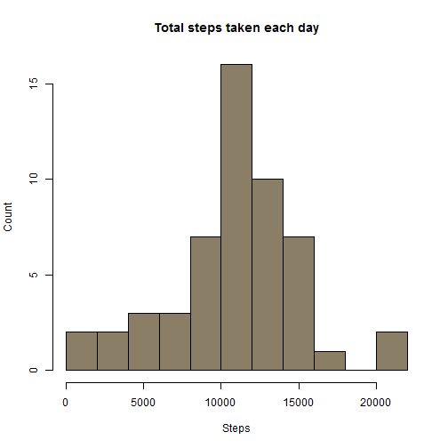
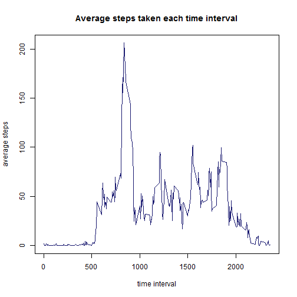
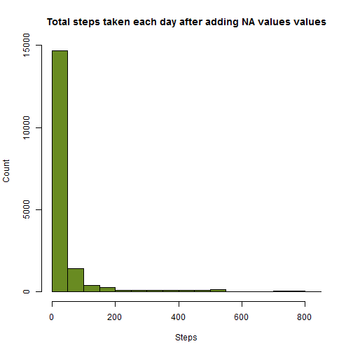

#Reproducible Research
#======================

```r
# Install and load required libraries
library(timeDate)
library(lattice)
library(dplyr)
```

```r
# Read dataset
act<-read.csv("activity.csv",header = T)
```
#1. What is mean total number of steps taken per day?
#   ===============================================

```r
# Find NA records
actFlag<-complete.cases(act)
# Take only non-NA records
activity<-act[actFlag,]
# Convert character date fields to date class
dateclass<-strptime(activity$date,"%Y-%m-%d")
# Bind the column of dateclass with the original data
actData<-cbind(activity,dateclass)
# Aggregate total steps by date
daySteps<-aggregate(actData$steps, by = list(actData$dateclass), FUN = "sum")
#Plot histogram
hist(daySteps$x, col="wheat4", 
     breaks = 10,
     main="Total steps taken each day", 
     xlab="Steps",
     ylab = "Count")
```



#1.1. See summary statistics, mean median
#     ----------------------------------

```r
summary(daySteps$x)
```

```
##    Min. 1st Qu.  Median    Mean 3rd Qu.    Max. 
##      41    8841   10760   10770   13290   21190
```


#2. What is the average daily activity pattern?
#   =========================================


```r
# Calculate mean number of steps in each interval
intSteps<-aggregate(actData$steps, 
                    by = list(actData$interval), 
                    FUN = "mean")
#Plot time series
plot(intSteps$x~intSteps$Group.1, col="midnightblue", 
     type='l',
     main="Average steps taken each time interval", 
     xlab="time interval",
     ylab = "average steps")
```



#Imputing missing values
#========================

```r
# Strategy for filling up missing values:
#----------------------------------------
# I will take the average no. of steps of that time interval 
# for all the days to fill up NA values, with truncating  
# or approximating the decimal points.

# Merge activity dataset with the intSteps data
# with interval as a key
act<-merge(act,intSteps,
                      by.x ="interval" ,
                      by.y = "Group.1")
# if steps = NA, then mutate rounded average value, else keep # steps
act<-mutate(act,steps= ifelse(is.na(steps),
                              round(x,digits = 0),steps))
# Remove extra variable x (average steps)
actClean<-select(act,-x)
# Again, use strip time to get date class
dateclass<-strptime(actClean$date,"%Y-%m-%d")
# Add the Date column in the table
actClean<-cbind(actClean,dateclass)
# Aggregate on date, total steps
daySteps<-aggregate(actClean$steps, 
                    by = list(actClean$dateclass), 
                    FUN = "sum")
# Plot histogram
hist(actClean$steps, col="olivedrab4", 
     breaks = 25,
     main="Total steps taken each day after adding NA values values", 
     xlab="Steps",
     ylab = "Count")
```



# Are there differences in activity patterns between weekdays and weekends?
#============================================================

```r
# I will use lattice package to plot and timeDate package
# to find weekday or weekend

# First, calculate mean count of steps, on date and interval
brkSteps<-aggregate(actData$steps, 
                by=list(actData$dateclass,
                        actData$interval), 
                    FUN = "mean")
# Rename the headers
names(brkSteps)<-c("Date","Interval",
                   "AverageSteps")
# Find weekday or weekend
dayWeek<-ifelse(isWeekday(brkSteps$Date,wday=1:5)==T,
                "Weekday","Weekend")

# Add the column dayWeek(weekday or weekend)
brkSteps<-cbind(brkSteps,dayWeek)

# plot

xyplot(AverageSteps~Interval|dayWeek,col = "slateblue4",
       data = brkSteps,type="l", layout=c(1,2))
```


